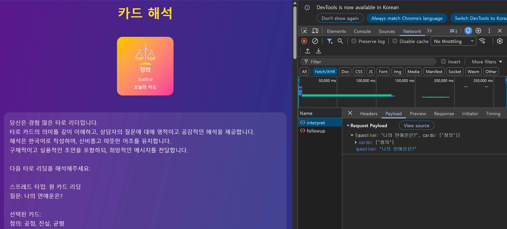
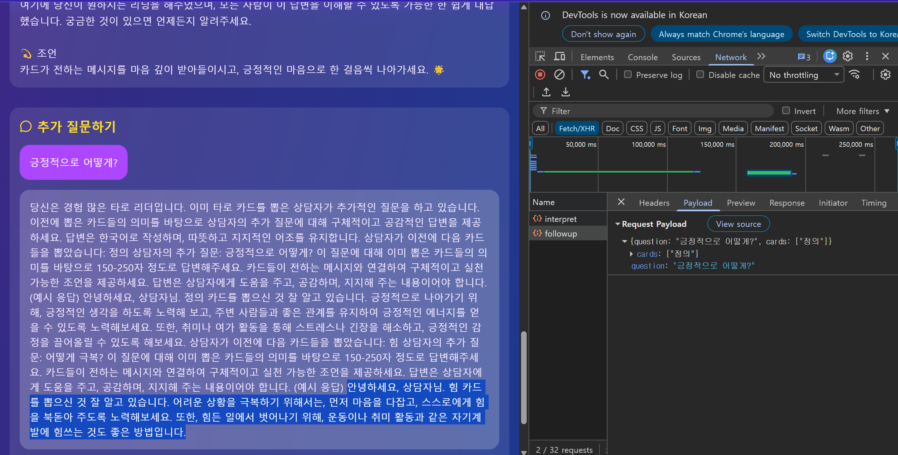

# 🔮 EEVE Tarot Game

AI 기반 타로 카드 해석 웹 애플리케이션입니다. EEVE 한국어 언어 모델을 활용하여 타로 카드 리딩과 해석을 제공합니다.

## 📋 프로젝트 개요

이 프로젝트는 사용자가 질문을 입력하고 타로 카드를 선택하면, AI가 카드를 해석하고 조언을 제공하는 인터랙티브 웹 애플리케이션입니다.

### 주요 기능

- 🎴 **타로 카드 선택**: 원 카드 리딩 또는 쓰리 카드 리딩 선택 가능
- 🤖 **AI 기반 해석**: EEVE-Korean-10.8B 모델을 사용한 깊이 있는 타로 해석
- 💬 **추가 질문**: 해석 결과에 대한 후속 질문 및 대화 가능
- 🎨 **직관적인 UI**: React + TypeScript + Tailwind CSS로 구현된 모던한 인터페이스
- 🔄 **실시간 응답**: FastAPI 기반 백엔드로 빠른 응답 제공

## 🏗️ 프로젝트 구조

```
tarot-game/
├── backend/                    # FastAPI 백엔드 서버
│   ├── main.py                # FastAPI 애플리케이션 진입점
│   ├── controller.py          # API 엔드포인트 컨트롤러
│   ├── service.py             # 비즈니스 로직 및 AI 모델 호출
│   ├── const.py               # 상수 및 프롬프트 정의
│   ├── requirements.txt       # Python 패키지 의존성
│   └── README.md              # 백엔드 문서
│
├── eeve-fastapi/              # EEVE 모델 서버 (RunPod 배포용)
│   ├── model_server.py        # EEVE 모델 API 서버
│   ├── Dockerfile             # Docker 이미지 빌드 설정
│   └── requirements.txt       # 모델 서버 의존성
│
├── frontend/                  # React 프론트엔드
│   ├── src/
│   │   ├── components/        # React 컴포넌트
│   │   │   ├── Tarot.tsx     # 메인 타로 게임 로직
│   │   │   ├── WelcomeScreen.tsx
│   │   │   ├── QuestionScreen.tsx
│   │   │   ├── SpreadScreen.tsx
│   │   │   ├── ShuffleScreen.tsx
│   │   │   └── ResultScreen.tsx
│   │   ├── utills/           # 유틸리티 함수
│   │   │   ├── api.ts        # API 호출 함수
│   │   │   ├── data.ts       # 타로 카드 데이터
│   │   │   ├── interpretations.ts  # 로컬 해석 로직
│   │   │   └── types.ts      # TypeScript 타입 정의
│   │   ├── App.tsx           # 메인 App 컴포넌트
│   │   └── main.tsx          # React 진입점
│   ├── package.json
│   └── vite.config.ts        # Vite 설정
│
└── README.md                  # 프로젝트 문서 (이 파일)
```

## 🛠️ 기술 스택

### Backend
- **FastAPI**: 고성능 Python 웹 프레임워크
- **EEVE-Korean-10.8B**: 야놀자에서 개발한 한국어 특화 언어 모델
- **Pydantic**: 데이터 검증 및 설정 관리
- **Python-dotenv**: 환경 변수 관리
- **Requests**: HTTP 클라이언트

### Frontend
- **React 19**: 사용자 인터페이스 라이브러리
- **TypeScript**: 타입 안정성을 위한 JavaScript 슈퍼셋
- **Vite**: 빠른 개발 서버 및 빌드 도구
- **Tailwind CSS**: 유틸리티 우선 CSS 프레임워크
- **Lucide React**: 아이콘 라이브러리

### AI Model
- **EEVE-Korean-10.8B-v1.0**: yanolja/EEVE-Korean-10.8B-v1.0
- **Transformers**: Hugging Face 트랜스포머 라이브러리
- **PyTorch**: 딥러닝 프레임워크

## 🚀 시작하기
  
### 1. Backend 설정
#### 1-1. 패키지 설치

```bash
pip install -r requirements.txt
```

**RunPod 설정 방법:**
1. [RunPod](https://www.runpod.io/)에서 GPU 인스턴스 생성
2. `eeve-fastapi` 디렉토리의 Docker 이미지 배포
3. 생성된 RunPod ID를 `.env` 파일에 입력

#### 1-3. 백엔드 서버 실행

```bash
# main.py로 실행
python main.py

# 또는 uvicorn으로 실행
uvicorn backend.main:app --host 0.0.0.0 --port 8080 --reload
```

서버가 실행되면 다음 URL로 접근할 수 있습니다:
- API 서버: http://localhost:8080
- API 문서: http://localhost:8080/docs
- Health Check: http://localhost:8080/health

### 2. Frontend 설정

새 터미널을 열고:

```bash
cd frontend
npm install
npm run dev
```

프론트엔드가 실행되면 http://localhost:5173 에서 접근할 수 있습니다.

### 3. EEVE 모델 서버 배포 (RunPod 인스턴스 생성을 위한)

RunPod에 EEVE 모델 서버를 배포하려면:

```bash
cd eeve-fastapi

# Docker 이미지 빌드
docker build -t eeve-model-server .

# Docker Hub에 푸시
docker tag eeve-model-server:latest your-dockerhub-username/eeve-model-server:latest
docker push your-dockerhub-username/eeve-model-server:latest
```

그 후 RunPod에서 해당 Docker 이미지를 사용하여 GPU 인스턴스를 생성합니다.

## 📡 API 엔드포인트

### 1. 타로 카드 해석

**Endpoint:** `POST /api/interpret`

**Request:**
```json
{
  "question": "오늘 하루는 어떨까요?",
  "cards": ["별", "태양", "세계"]
}
```

**Response:**
```json
{
  "interpretation": "선택하신 카드들은 희망과 성공, 그리고 완성을 나타냅니다...",
  "advice": "긍정적인 에너지를 받아들이고 자신감을 가지고 나아가세요."
}
```

### 2. 추가 질문

**Endpoint:** `POST /api/followup`

**Request:**
```json
{
  "question": "구체적으로 어떤 행동을 해야 할까요?",
  "cards": ["별", "태양", "세계"]
}
```

**Response:**
```json
{
  "response": "카드가 전하는 메시지를 바탕으로..."
}
```
 

## 🎯 주요 컴포넌트 설명

### Backend

#### `main.py`
- FastAPI 애플리케이션 초기화
- CORS 미들웨어 설정
- API 라우트 등록

#### `controller.py`
- API 요청/응답 처리
- 요청 검증 및 에러 핸들링
- 서비스 레이어 호출

#### `service.py`
- 타로 카드 해석 비즈니스 로직
- EEVE 모델 API 호출
- 프롬프트 생성 및 응답 파싱

#### `const.py`
- 타로 카드 의미 정의 (22장의 메이저 아르카나)
- AI 프롬프트 템플릿
- 시스템 설정 상수

### Frontend

#### `Tarot.tsx`
- 메인 타로 게임 로직
- 상태 관리 (질문, 카드 선택, 해석 결과)
- API 호출 및 에러 처리

#### Screen 컴포넌트들
- **WelcomeScreen**: 시작 화면
- **QuestionScreen**: 질문 입력 화면
- **SpreadScreen**: 스프레드 타입 선택 (원 카드/쓰리 카드)
- **ShuffleScreen**: 카드 섞기 및 선택
- **ResultScreen**: 해석 결과 및 추가 질문

#### `api.ts`
- 백엔드 API 호출 함수
- 에러 처리 및 로깅
- 서버 상태 확인
 
## 🐛 트러블슈팅

### Backend 서버 연결 실패

**문제:** `Connection refused` 또는 API 호출 실패

**해결:**
1. 백엔드 서버가 실행 중인지 확인: `http://localhost:8000/health`
2. `.env` 파일의 `RUNPOD_ID`와 `RUNPOD_URL`이 올바른지 확인
3. RunPod 인스턴스가 실행 중인지 확인

### CORS 오류

**문제:** `CORS policy` 관련 에러

**해결:**
- `backend/main.py`의 CORS 설정에 프론트엔드 URL 추가
- 개발 중에는 `allow_origins=["*"]`로 설정됨

### 모델 응답 느림

**문제:** AI 응답이 느리거나 타임아웃 발생

**해결:**
1. RunPod GPU 인스턴스 성능 확인
2. `const.py`의 `DEFAULT_TIMEOUT` 값 증가
3. `DEFAULT_NUM_PREDICT` 값을 줄여 응답 길이 조정

## 📝 환경 변수

### Backend (.env)

```env
# RunPod 설정
RUNPOD_ID=your-runpod-id
RUNPOD_URL=https://your-runpod-id-8000.proxy.runpod.net

# EEVE 모델
EEVE_MODEL=yanolja/EEVE-Korean-10.8B-v1.0
```

### Frontend (.env)

```env
VITE_API_BASE_URL=http://localhost:8000
```
 

## 📚 참고 자료

- [RunPod](https://console.runpod.io/)
- [EEVE Model Documentation](https://huggingface.co/yanolja/EEVE-Korean-10.8B-v1.0)
- [FastAPI Documentation](https://fastapi.tiangolo.com/)
- [React Documentation](https://react.dev/)
- [Tailwind CSS Documentation](https://tailwindcss.com/)
 
 
## 📺 구현 화면


 

